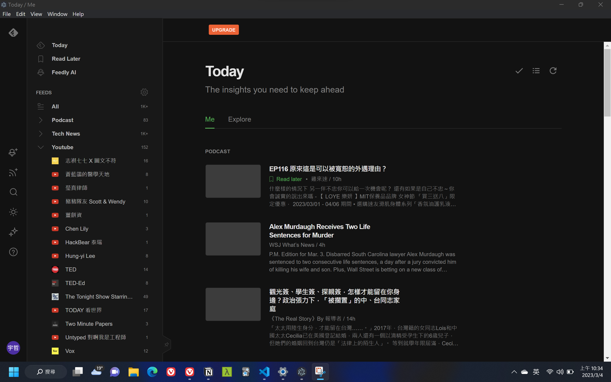

# Feedlier

A special browser for Feedly

## Prerequisite

You need to install NodeJS first.

## Quick Start

Run the following command to start the application

```c
yarn start
```

Then window would appear like following.

